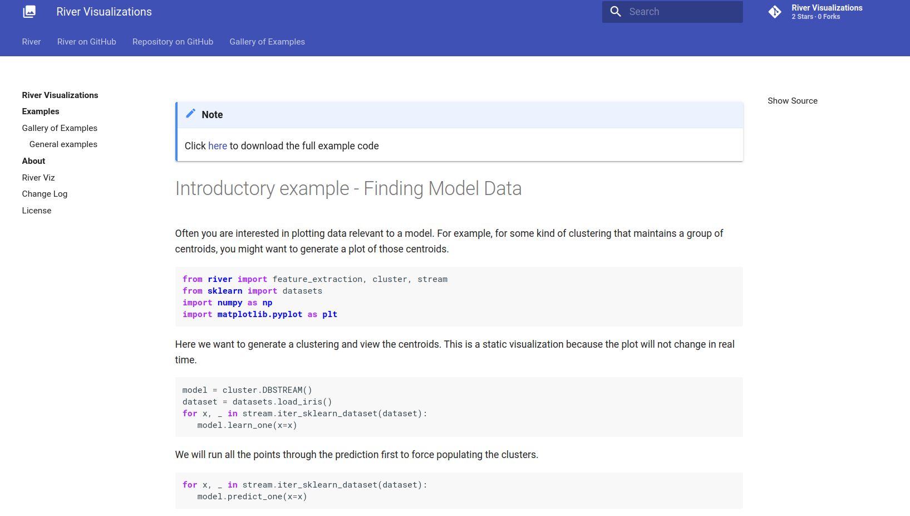

# River Viz

_Visualization examples using River_

This is a repository of river visualizations to help guide you with using river!
We use [sphinx-gallery](https://sphinx-gallery.github.io/stable/getting_started.html) for the 
examples and visualizations, and [sphinx-material](https://github.com/bashtage/sphinx-material/)
for the template to match [https://riverml.xyz/](https://riverml.xyz/).

See our [contributing guide](contributing.md) for how to add an example, or 

⭐️ [View the Interface](https://online-ml.github.io/viz/) ⭐️

## 😁️ Contributors 😁️

We use the [all-contributors](https://github.com/all-contributors/all-contributors) 
tool to generate a contributors graphic below.

<!-- ALL-CONTRIBUTORS-LIST:START - Do not remove or modify this section -->
<!-- prettier-ignore-start -->
<!-- markdownlint-disable -->
<table>
  <tr>
    <td align="center"><a href="https://vsoch.github.io"> <b>Vanessasaurus</b></a> <a href="https://github.com/online-ml/viz/commits?author=vsoch" title="Code">💻</a></td>
  </tr>
</table>

<!-- markdownlint-restore -->
<!-- prettier-ignore-end -->

<!-- ALL-CONTRIBUTORS-LIST:END -->
